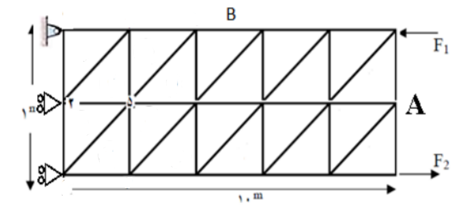
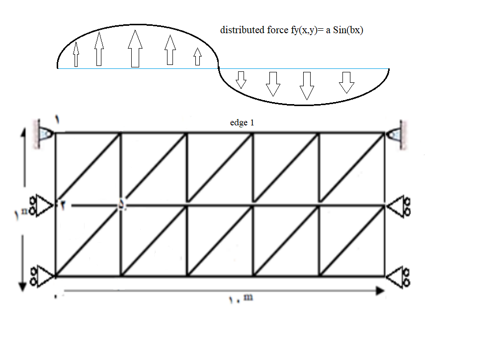

# FEM-analysis-of-2D-triangle-mesh-using-Matlab
 


This **MATLAB** toolbox can be used to solve 2D structures meshed by triangle elements using finite element analysis. It reads the question inputs (Places of nodes, forces, boundary conditions...) from an excel file.

It takes three types of **boundary condition** into account.
* Fixed boundary condition with **zero displacement** of a node for each direction.
* **Non-zero** transformation of nodes in each direction.
* Boundary conditions with an **angle** with the horizon(ramp).

It also accepts **concentrate forces** on nodes, **thermal forces** on elements, and **distributed forces** on the edges of the structure.
  
## Model Input
Structure’s data (nodes' position, elements, material characteristics, forces, and boundary conditions) are fed to model by an Excel file.
**Explaining excel input file:**
The excel file has seven pages.
* **Nodes page**: The first column is node index and second and third columns are x and y position of nodes, respectively.
* **Elements page**: The first column is the number of nodes in the element, which is 2 for truss elements. Other columns are the index of nodes in this element.
* **Material page**: The first column is element index and others are area, elasticity coefficient, and thermal linear expansion coefficient. 
* **AngleBC page**: It is for **Ramp Boundary Condition**. The first column is the node number that is on a ramp and the second column is the ramp angle.
* **BC page**: it is for **Boundary Condition**. The first column is the index of degree of freedom in the **Global displacement vector**. For example if it is 6, it means that the third node is limited in the y direction. The second column is the displacement of constrained degree of freedom.
* **Force page**: It is the amount of concentrated force on each degree of freedom. Like BC matrix, its size is same as Global displacement vector.
* **thermal page**: The first column is element index and second column is the temperature difference of element.
* **edge page**: This page is used to define an edge of the structure. It is useful when applying distributed force on that edge. The first and second columns of this page are the node index of the element's surface that are in that edge. The third column is the tickness of that surface. 

## How to use it
After making excel input file form the structure just call ```Solve_Triangle(ExcelPath,MagnifyingScale,DistributedForces)``` function. 
* **'ExcelPath'** is the path to your excel file as string. If the excel file is in the same directory as the Solve_Triangle.m file just write excel file name. For example: ```Solve_Triangle('Triangle.xlsx',1000)```
* **MagnifyingScale** magifys the displacements in plotting
* **DistributedForces** is an optional argument. It has to be a <a href="https://www.mathworks.com/help/matlab/cell-arrays.html">**cell array**</a> with three columns. Each row is for one distributed force. The first column is the page number of excel file allocated to the edge under distributed load. The second and third columns are function handlers for distributed force in the direction of x and y. Both of these functions have to be relative to x and y. For example: ``` DistributedForces ={8,  @(x,y) (0),  @(x,y) (-10*x^2) } ```


## Example with consentrated forces
We have an structure under load as follow:
<p float="middle">
    
</p>

The nodes are indexed in this way:

<p float="middle">
    
</p>

The input file is <a href="https://github.com/emadfrj/FEM-analysis-2D-triangle-mesh/blob/main/Triangle.xlsx">Triangle.xlsx</a> 

By calling Solve_Triangle function ```Solve_Triangle('Triangle.xlsx',1000)``` we would have the results like the following picture.

<p float="middle">
    
</p>

## Example with distributed force
We have an structure that its uper edge is under sinusoidal load as follow:

<p float="middle">
    
</p>


```DistributedForces ={8,  @(x,y) (0),  @(x,y) 100000*sin(0.2*pi*x) }```     
8th page of excel file is for upper edge of structure

The nodes are indexed in this way:

<p float="middle">
    
</p>

The input file is <a href="https://github.com/emadfrj/FEM-analysis-2D-triangle-mesh/blob/main/TriangleDistributedForce.xlsx">TriangleDistributedForce.xlsx</a> 

By calling Solve_Triangle function ```Solve_Triangle('Triangle.xlsx',100000,  {8,  @(x,y) (0),  @(x,y) 100000*sin(0.2*pi*x) } )``` we would have the results like the following picture.

<p float="middle">
    
</p>
